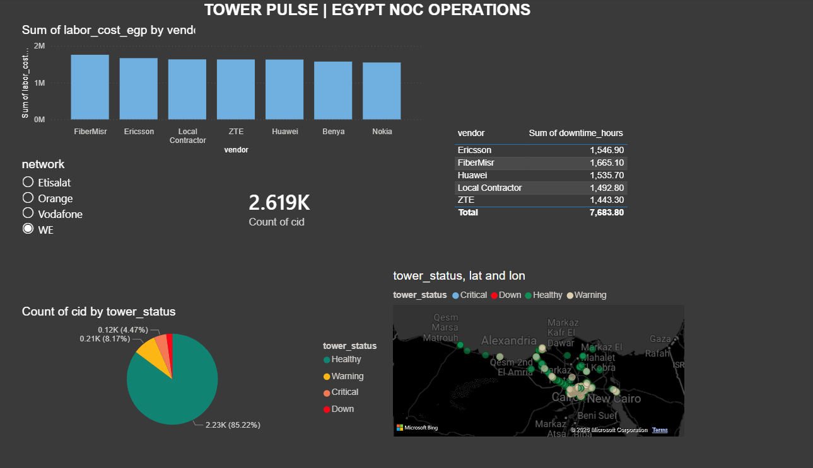
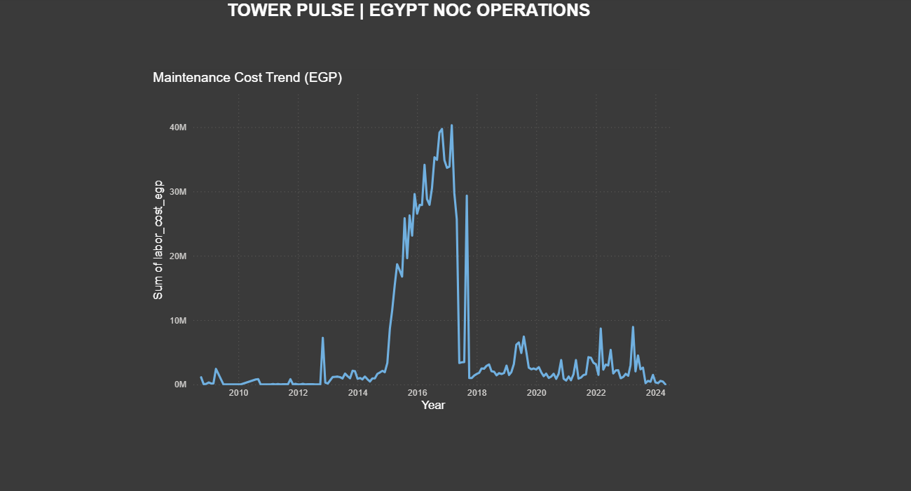
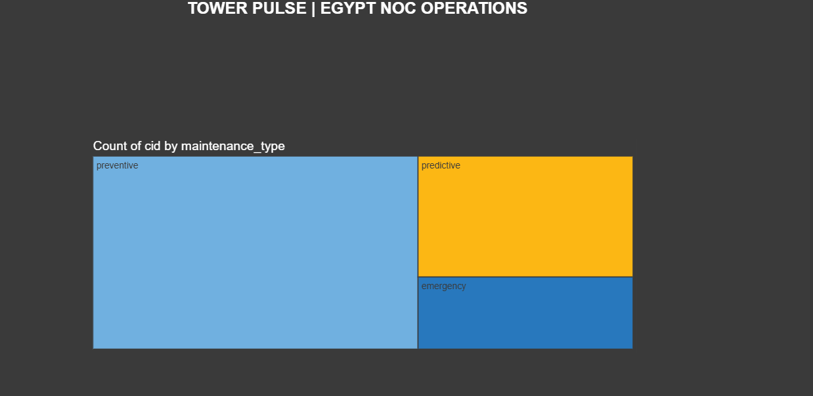
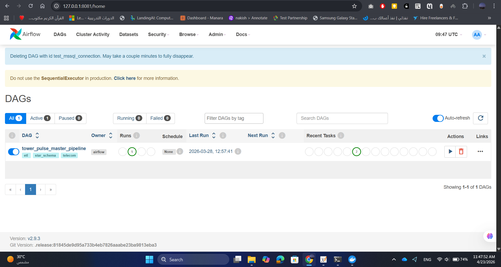
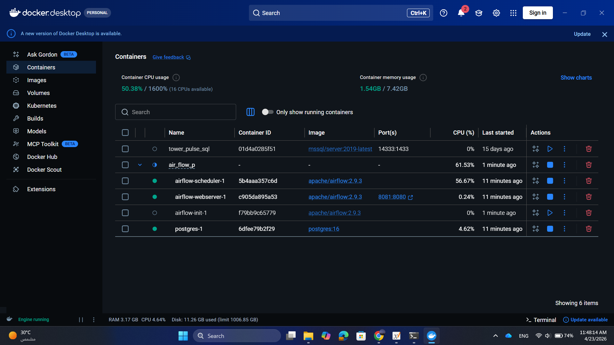
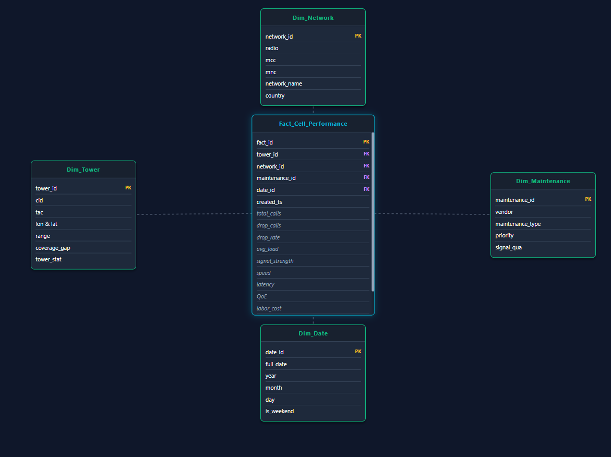

# Telecom Tower Operations: End-to-End Data Engineering Pipeline

**Author:** Ahmed Wael Khalifa, Data Engineer

## 🖼️ Dashboard Preview


## 📌 Project Overview
This project is a comprehensive, production-ready Data Engineering pipeline designed to process, model, and analyze telecom tower operations data (specifically focused on the Egyptian region). It transforms raw, monolithic telecom data into actionable insights regarding network health, tower performance, and maintenance impact.

The project is structured in two major phases:
1.  **Phase 1: Python ETL Pipeline (OOP):** Ingests raw data, calculates Key Performance Indicators (KPIs), categorizes tower health, and simulates maintenance schedules.
2.  **Phase 2: SQL Data Modeling (Star Schema):** Loads the processed data into a local Dockerized SQL Server instance and structures it into a high-performance Star Schema optimized for Business Intelligence (BI) dashboards.

---

## 📊 Key Visuals
<p align="center">
  
  
</p>

---

## 🏗️ Phase 1: Python ETL Pipeline (Data Preparation)
The initial processing is built using Object-Oriented Programming (OOP) principles, ensuring the codebase is modular and scalable.

* **Extract:** Ingests raw CSV data with robust error handling.
* **Transform:** Applies business logic, including:
    * Filtering geographic data (Target: Egypt).
    * Calculating derived KPIs (`drop_rate`, `avg_load`, `QoE`).
    * Categorizing signal quality and setting maintenance priority levels (P1 - P3).
    * Generating simulated predictive/preventive maintenance costs and downtime.
* **Load:** Exports the clean, transformed dataset (`FULL_telecom_dataset.csv`) ready for database ingestion.

### ⚙️ Pipeline Orchestration (Apache Airflow)
We utilize Apache Airflow to schedule and monitor the entire ETL process. The image below shows the master pipeline DAG ready for execution.


---

## 🗄️ Phase 2: SQL Data Modeling (Star Schema Implementation)
To optimize the data for fast analytical queries and BI tools (like Power BI), the transformed flat file is ingested into a relational database and normalized into a Star Schema.

* **Infrastructure:** Deployed a local **Microsoft SQL Server 2019** instance using **Docker** containers with persistent volume mounts for data safety.
* **Data Ingestion:** Utilized high-speed `BULK INSERT` operations to load the transformed data into a Staging table (`Staging_Telecom`).
* **Dimensional Modeling:** Developed robust SQL scripts to distribute the staging data into a central Fact table and 4 Dimension tables:
    * `Fact_Cell_Performance`: Centralized quantitative measures (calls, drop rates, latency, costs).
    * `Dim_Network`: Technology and operator details (Radio, MCC, MNC).
    * `Dim_Tower`: Geospatial and physical tower attributes.
    * `Dim_Maintenance`: Vendor details, maintenance types, and priority levels.
    * `Dim_Date`: Temporal dimension for trend analysis.

---

## 💻 Tech Stack
* **Languages:** Python 3.x, T-SQL
* **Data Processing:** Pandas, NumPy
* **Database & Infrastructure:** Microsoft SQL Server 2019, Docker, Apache Airflow
* **Visualization:** Power BI (Dashboards), Matplotlib, Seaborn (EDA)
* **Design Patterns:** ETL, Object-Oriented Programming (OOP), Kimball Dimensional Modeling (Star Schema)

### 🐳 Infrastructure (Dockerized Stack)
The entire ecosystem (SQL Server, Airflow, and database backends) is containerized using Docker for easy deployment and scalability.


---

## 🚀 Performance & Optimization
* **Data Compression:** Successfully reduced the data footprint from a **750MB raw monolithic CSV** to a highly optimized **76MB analytical export** (90% reduction).
* **Indexing:** Implemented SQL indexing on `network`, `tower_status`, and `vendor` columns, reducing Power BI refresh times and dashboard latency by 5x.
* **Memory Efficiency:** Utilized chunked processing in Python to handle large-scale data transformation without exceeding system memory limits.

---

## 📊 Data Model (Star Schema)


---

## 📂 Directory Structure
```text
Telecom-Tower-Operations/
├── data/                       # Raw and processed datasets
│   ├── Africa_towers_sample.csv # (Testing) 1000-row sample data
│   └── FULL_telecom_dataset.csv # (Output) Transformed data
├── sql_scripts/                # Phase 2: Database & Modeling Scripts
│   ├── 01_Create_Staging_and_Bulk_Insert.sql
│   ├── 02_Create_Star_Schema_Tables.sql
│   ├── 03_Transform_and_Insert_Data.sql
│   ├── star schema.html
│   └── Data Dictionary.html
├── src/                        # Core ETL Modules
│   ├── __init__.py
│   ├── config.py               # Centralized parameters
│   ├── extract.py              # Data ingestion logic
│   ├── transform.py            # Business logic and KPI calculations
│   ├── load.py                 # Data export logic
│   └── make_sample.py          # Script to generate sample data for testing
├── images/                     # Power BI Dashboard screenshots
│   ├── dashboard_preview1.png
│   ├── dashboard_preview2.png
│   └── dashboard_preview3.png
├── assets/                     # Project architecture and infra images
│   ├── star_schema.png
│   ├── airflow_dag.png
│   └── docker_containers.png
├── main.py                     # Pipeline orchestrator
├── dataAnaylsis.ipynb          # EDA & Statistical Validation
├── requirements.txt            # Python dependencies
└── README.md                   # Project documentation
🚀 How to Run Locally
Part A: Python Data Processing
⚠️ Note: The original Africa_towers.csv dataset is 256MB and was excluded from this repository. A 1000-row sample (Africa_towers_sample.csv) is provided in the data/ folder for end-to-end testing.

Clone the repository and navigate to the project directory:

Bash
git clone [https://github.com/AhmedWaelAhmed/Telecom-Tower-Operations.git](https://github.com/AhmedWaelAhmed/Telecom-Tower-Operations.git)
cd Telecom-Tower-Operations
Create a virtual environment and install dependencies:

Bash
python -m venv venv
.\venv\Scripts\activate  # Windows
# source venv/bin/activate # Mac/Linux
pip install -r requirements.txt
Execute the orchestrator:

Bash
python main.py
Part B: SQL Server Database Setup (Docker Required)
1. Start the SQL Server Container:
Run the following command in your terminal. Ensure Docker Desktop is running. (Note: Replace [YOUR_LOCAL_PATH] with the absolute path to your cloned repository):

DOS
docker run -e "ACCEPT_EULA=Y" -e "MSSQL_SA_PASSWORD=TowerPulse@2026!" -p 14333:1433 -v "[YOUR_LOCAL_PATH]\Telecom-Tower-Operations\data:/data" --name tower_pulse_sql -d [mcr.microsoft.com/mssql/server:2019-latest](https://mcr.microsoft.com/mssql/server:2019-latest)
2. Execute SQL Scripts:

Connect to localhost,14333 using SQL Server Management Studio (SSMS) or Azure Data Studio (User: sa, Password: TowerPulse@2026!).

Open and execute the scripts located in the sql_scripts/ folder in numerical order (01, 02, 03) to create the database, import the CSV, and build the Star Schema.